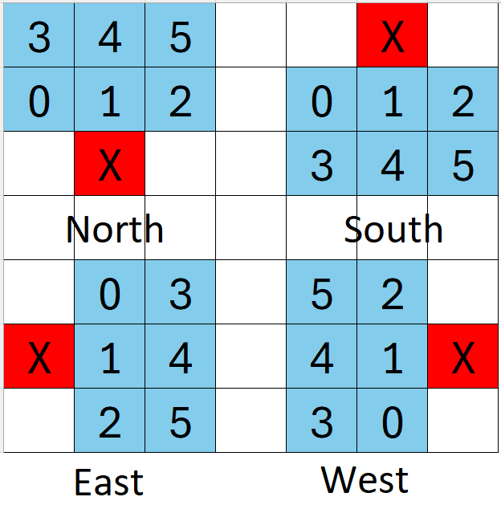

# Projekt Scorpio - zadanie rekrutacyjne do działu Software
W celu realizacji zadania konieczne będzie zainstalowanie ROS w wersji Noetic (zalecany system operacyjny to Ubuntu 20.04) lub ROS w wersji Melodic (Ubuntu 18.04).
Na repozytorium znajduje się paczka ROS zawierająca symulację jazdy autonomicznej łazika.
>**Uwaga!** Przed przystąpieniem do realizacji zadania przeczytaj **całe** README.
## Spis treści
- [Informacje ogólne](#informacje-ogólne)
- [Zadania do wykonania](#zadania-do-wykonania)
- [Specyfikacja techniczna zadania](#specyfikacja-techniczna-zadania)
  - [Specyfikacja danych](#specyfikacja-danych)
  - [Uruchamianie symulatora](#uruchamianie-symulatora)
- [Wskazówki i przydatne linki](#wskazówki-i-przydatne-linki)
- [Przydatne ROSowe komendy CLI](#przydatne-rosowe-komendy-cli)

## Informacje ogólne
Zadanie symuluje autonomiczną nawigację łazika składającą się z: mapowania terenu, planowania ścieżki dojazdu do celu i zadawania komend sterowania łazikiem. Dla tego zadania przyjmujemy, że mapa składa się z kwadratowych komórek i łazik zajmuje zawsze jedną komórkę mapy. Łazik porusza się po mapie 50x50 zawsze zaczynając w pozycji (0,0) - lewy dolny róg mapy. Punkt (0,0) zawsze znajduje się na wysokości 0. Na początku łazik zawsze zorientowany jest na północ.

Komórki mapy wysokości, po której łazik porusza się w zadaniach 3 i 4 zawierają wartości liczbowe ze zbioru (0,10,20,30,40,50,100) - jest to odwzorowanie nierównego terenu, po którym łazik się przemieszcza. Łazik może przy jednym ruchu maksymalnie zmienić wysokość o 10 np:
- będąc na komórce o wysokości 10 może wjechać na komórkę o wysokości 0, 10 lub 20
- będąć w komórce o wysokości 0 może wjechać na komórkę o wysokości 0 lub 10
- będąc w komórce o wysokości 50 może wjechać na komórkę o wysokości 50 lub 40 (nie 30, 20, 10 ani 0)
- łazik nigdy nie może wjechać na komórkę o wysokości 100

Mapa wysokości jest losowo generowana przy każdorazowym uruchomieniu symulacji.

W zadaniu 2 przyjmujemy, że każda komórka mapy ma wysokość 0 - łazik może bez problemu wjechać na dowolną jej komórke, należy jednak pamiętać, że łazik nie może wyjechać poza mapę.

## Zadania do wykonania 
W tej części znajdziesz ogólny opis zadań, szczegółowy opis wraz ze specyfikacją techniczną znajdziesz w sekcji [specyfikacja techniczna zadania](#specyfikacja-techniczna-zadania).

Pamiętaj, że zadanie służy sprawdzeniu wielu umiejętności - nie tylko programowania i znajomości algorytmów -  więc nawet w przypadku zrealizowania tylko części z poniższych punktów, zachęcamy do przesłania rozwiązania. Postępy w zadaniu powinny być udokumentowane w repozytorium na githubie (po każdym etapie zadania powinien zostać stworzony nowy commit).

1. Instalacja ROS i budowanie paczki z symulacją
- W repozytorium została przygotowana paczka ROS zawierająca napisaną przez nas symulacją jazdy autonomicznej łazika. Repozytorium należy sklonować i zbudować paczkę w ROS. Szczegóły działania paczki są opisane w sekcji [specyfikacja techniczna zadania](#specyfikacja-techniczna-zadania).

> **Wskazówka!** Dobrym rozwiązaniem jest "fork" paczki

2. Stworzenie node'a ROSowego do autonomicznego przejazdu po płaskim terenie:
- Node subskrybuje topic `/set_goal`, na który wysyłane są informacje o pozycji, do której łazik ma autonomicznie dojechać.
- Po zadaniu celu należy wyznaczyć optymalną sekwencję ruchów, która pozwoli dojechać do celu.
- Ruchy z tej sekwencji należy wysyłać na topic `/rover/move`, tak aby łazik osiągnął cel.
- Subskrybując topic `/rover/pose` można dostać informacje o obecnym położeniu łazika, która może posłużyć np. do weryfikacji czy cel został osiągnięty.

> **Uwaga!** Zadawanie celu odbywa się poprzez wysłanie na topic `/set_goal` wiadomości z koordynatami celu. Wiadomość tą można wysyłać np. z terminalu za pomocą komendy `rostopic pub`.

3. Rozszerzenie node'a o planowanie po nierównym terenie z przeszkodami:
- W pliku `/launch/autonomy_simulator.launch` zmień wartość parametru `generate_obstacles` na `true`. To sprawi, że po uruchomieniu symulacji łazik nie będzie znajdował się na płaskim terenie.
- Node za pomocą serwisu `/get_map` pobiera obecną mapę całości terenu. Ta mapa jest mapą wysokości - zawiera elewację terenu, jak i nieprzejezdne przeszkody.
- Moduł planowania ścieżki (sekwencji ruchów) trzeba uzupełnić tak, aby brał pod uwagę elewację terenu i omijał przeszkody z mapy pobranej z powyższego serwisu.
- Jeżeli zadany cel nie jest możliwy do osiągnięcia należy na ROS_ERROR wypisać komunikat, że dojazd do celu jest niemożliwy, zaniechać wszelką jazdę i czekać na kolejne zadanie celu.

> **Wskazówka!** Pamiętaj o regularnym commitowaniu zmian

4. Planowanie ścieżki i jazda po nieznanej mapie:
- Łazik podobnie jak w poprzednim zadaniu porusza się po mapie wysokości, jednak jest ona nieznana. Na topicu `/rover/sensor` znajdują się dane o wysokości względnej punktów 2x3 komórki mapy przed łazikiem. Są to dane z symulowanego czujnika służącego do mapowania terenu na łaziku.
- Nie wolno korzystać z serwisu `/get_map`.
- Należy w pamięci przechowywać mapę i utrwalać na niej odczyty z sensora po każdym ruchu.
- Ścieżka (sekwencja ruchów) powinna być dynamicznie aktualizowana wraz z odkrywaniem nowych danych komórek mapy.
- Na topic `/rover/map` ma być publikowana po każdym ruchu obecna mapa. Komórki, których wartości nie są znane powinny mieć wartość -1.

> **Uwaga!** wysokość względna oznacza że łazik znajdując się na komórce o wysokości 10 i widząc przed sobą komórkę o wysokości 20 to wysokość komórki przed łazikiem wynosi 30 i jako taką wartość należy ją do mapy zapisać - mogą to też być wartości ujemne jeżeli łazik przed sobą ma komórki o mniejszej wysokości.

## Specyfikacja techniczna zadania
> **Uwaga!** Nie modyfikuj plików utworzonych przez nas znajdujących się w paczce ROS (oprócz pliku autonomy_simulator.launch).

**Nazwa paczki ROS** - `autonomy_simulator`  

**autonomy_simulator** - przygotowany przez nas node symulujący łazika i teren, po którym ma on przejechać. Jego kod znajdziesz w `include/autonomy_simulator/autonomy_simulator.hpp` oraz `src/autonomy_simulator.cpp`.

### Specyfikacja danych
1. Topic `/set_goal`

Topic ten ma być subskrybowany przez node'y tworzone na potrzeby zadań, ma własny typ SetGoal zawierający koordynaty x i y w postaci dodatnich liczb całkowitych (UInt8).
Przykład publikacji na topic `/set_goal` za pomocą komendy rostopic pub z cli: `rostopic pub /set_goal autonomy_simulator/SetGoal "x: 5 y: 10"`

2. Topic `/rover_map`
   
Topic ten ma być publikowany przez node stworzony na potrzeby zadania 4. Na topic należy publikować tablicę **jednowymiarową** ośmiobitowych liczb całkowitych (Int8). Do tego należy wykorzystać stworzony przez nas własny typ wiadomości ROSowej - RoverMap. Tablicę należy uzupełnić w sposób identyczny do mapy pozyskiwanej za pomocą serwisu `/get_map` opisanego poniżej.

3. Topic `/rover/move`
   
Topic jest subskrybowany przez node `autonomy_simulator`. W jego wiadomości jest zawarta komenda sterująca łazikiem. Jest to dodatnia 8-bitowa liczba całkowita (w ROS - UInt8) **w zakresie od 0 do 3 włącznie**. Każdy numer odpowiada innemu ruchowi, a mapowania są następujące:
- 0: obrót łazika w miejscu w lewo o 90 stopni
- 1: obrót łazika w miejscu w prawo o 90 stopni
- 2: jazda do przodu
- 3: jazda do tyłu

**Na topic `/rover/move` nie należy wysyłać danych częściej niż 10 razy na sekundę**

4. Topic `/rover/pose`
   
Topic jest publikowany przez node `autonomy_simulator` 10 razy na sekundę. Zawiera informacje o obecnej pozycji łazika. Jego wiadomość ma stworzony przez nas typ RoverPose - jego szczegóły można znaleźć w `msg/RoverPose.msg`. Wiadomość zawiera 3 pola (wszystkie są 8-bitowymi danymi całkowitoliczbowymi - Int8):
- x: pozycja x na mapie
- y: pozycja y na mapie
- orientation: 0-północ, 1-wschód, 2-południe, 3-zachód

Północ oznacza, że łazik jest zorientowany wzdłuż osi y (będąc w pozycji (0,0) patrzy na komórkę (0,1).
Dodatkowo jeżeli łazik znajdzie się w pozycji niedozwolonej (w przeszkodzie, na którą nie powinien wjechać lub poza mapą) to wszystkie pola będą miały wartość -1, a łazik nie będzie przyjmować już wtedy poleceń ruchu. W takiej sytuacji należy zrestartować symulację i spróbować wykonać przejazd ponownie.

5. Serwis `/get_map`
   
Node `autonomy_simulator` rozgłasza serwis `/get_map`, który pozwala pobrać mapę terenu wymaganą do zadania 3. Informacje zwracane przez mapę są w postaci tablicy **jednowymiarowej** ośmiobitowych liczb całkowitych (Int8). Każdy rząd w tej tablicy jest wypisany po kolei. To oznacza że:
- komórka (0,0) będzie się znajdować na pierwszym miejscu tablicy (indeks 0)
- komórka (1,0) będzie się znajdować na drugim miejscu tablicy (indeks 1)
- komórka (0,1) będzie się znajdować na pięćdziesiątym pierwszym miejscu tablicy (indeks 50)
- w sumie tablica będzie miała 2500 pól, gdzie ostatnie (o indeksie 2499) będzie oznaczać pole (50,50)
Serwis ma własny typ GetMap - jego szczegóły można znaleźć w `srv/GetMap.srv`

6. Topic `/rover/sensor`
   
Topic jest publikowany przez node `autonomy_simulator`. Topic 10 razy na sekundę wysyła informacje o terenie przed łazikiem (3x2 komórki). Topic ma własny typ RoverMap - jego szczegóły można znaleźć w `msg/RoverMap.msg`. Jest on efektywnie małą mapą widzianą przed łazikiem i czytana jest podobnie jak wcześniej opisane mapy. Należy jednak pamiętać, że pokrycie danych z czujnika z mapą rzeczywistą będzie zależeć od rotacji łazika. Indeksy komórek publikowanej przez sensor tablicy jednowymiarowej w zależności od rotacji łazika wizualizuje poniższy rysunek (X to pozycja łazika):



Czujnik w niektórych pozycjach będzie widzieć komórki spoza mapy - wysokości tych komórek będą wynosić 100 i nie należy ich nanosić na mapę przechowywaną w pamięci.

### Uruchamianie symulatora
Po zbudowaniu paczki symulator można uruchomić dzięki launchfile za pomocą komendy:
```bash
roslaunch autonomy_simulator autonomy_simulator.launch
```
> **Uwaga!** Pamiętaj, że po zbudowaniu należy również wykonać `source devel/setup.bash` w workspace ROS!

## Wskazówki i przydatne linki
-	Zachęcamy do zapoznania się z poradnikiem przedstawiającym podstawy pracy w ROS: www.youtube.com/watch?v=wfDJAYTMTdk&ab_channel=RoboticsBack-End
-	Oficjalny tutorial ROS znajdziesz pod linkiem: http://wiki.ros.org/ROS/Tutorials
-	Do instalacji ROS można wykorzystać instrukcję (należy wybrać wersję desktop-full install): http://wiki.ros.org/noetic/Installation/Ubuntu 
- Do ręcznego wysłania danych na topic w ROS możesz użyć komendy `rostopic pub <nazwa_topicu> <typ_danych> <dane>` (po wpisaniu nazwy topicu dobrze jest od razu użyć TAB aby powłoka pomogła w wpisywaniu i zajęła się typem danych i formatem). Możesz to wykorzystać do weryfikacji działania node'a którego otrzymałeś oraz swoich node'ów.
- Możesz użyć komendy `rostopic echo <nazwa_topicu>` aby wyświetlić dane wysyłane na określony topic.
- Zadanie rekrutacyjne można oddać niepełne.
- Rozwiązane zadanie należy umieścić w **publicznym** repozytorium (np. GitHub) i przesłać linka do tego repozytorium na mail projekt@scorpio.pwr.edu.pl. Ewentualne pytania lub wątpliwości co do treści zadania można kierować na tego samego maila. Zadania przyjmujemy do 31.10.2024 do końca dnia.

## Przydatne ROSowe komendy CLI: 
- rostopic list - zwraca liste wszystkich dostępnych topiców
- rostopic echo <nazwa_topicu> - zwraca dane publikowane na topicu
- rostopic info <nazwa_topicu> - zwraca informacje o topicu
- rostopic pub <nazwa_topicu> <typ_message'a> <zawartość_message'a> - publikuje dane na topic
- rostopic hz <nazwa_topicu> - zwraca częstotliwość publikacji na topic
- rosservice list - zwraca liste wszystkich dostępnych serwisów
- rosservice info <nazwa_serwisu> - zwraca informacje o serwisie
- rosservice call <nazwa_serwisu> <typ_serwisu> <zawartość_requestu> - wywołuje serwis i zwraca odpowiedź wywołania
- rosnode info <nazwa node'a> - zwraca informacje o node'dzie


**Jeżeli będziesz miał jakiekolwiek wątpliwości i problemy z zadaniem śmiało skontaktuj się z nami na maila projekt@scorpio.pwr.edu.pl! Powodzenia :)**
