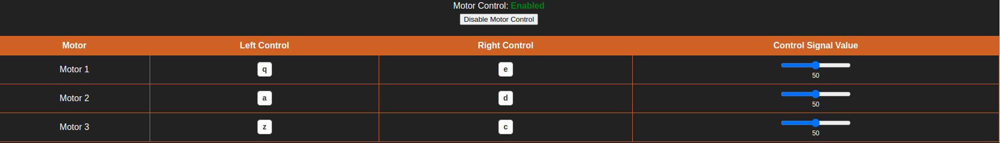
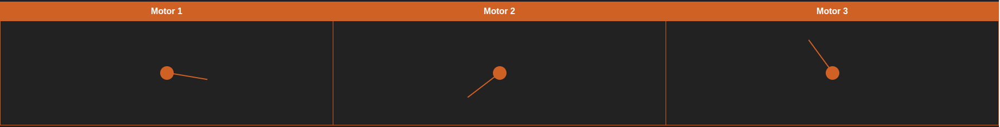
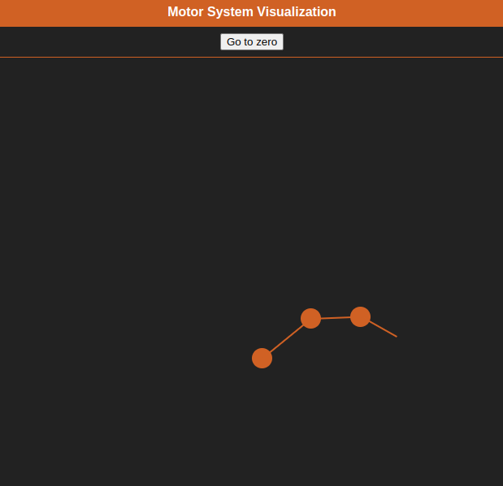

# Projekt Scorpio - zadanie rekrutacyjne do działu Software
W celu realizacji zadania konieczne będzie zainstalowanie ROS w wersji Noetic (zalecany system operacyjny to Ubuntu 20.04) lub ROS w wersji Melodic (Ubuntu 18.04).
Na repozytorium znajduje się paczka ROS zawierająca symulator silników z 	enkoderami absolutnymi.
>**Uwaga!** Przed przystąpieniem do realizacji zadania przeczytaj **całe** README.
## Spis treści
- [Zadania do wykonania](#zadania-do-wykonania)
- [Specyfikacja techniczna zadania](#specyfikacja-techniczna-zadania)
  - [Dane ogólne](#dane-ogólne)
  - [Specyfikacja danych](#specyfikacja-danych)
  - [Uwagi](#uwagi)
  - [Uruchamianie symulatora](#uruchamianie-symulatora)
- [Wskazówki i przydatne linki](#wskazówki-i-przydatne-linki)
- [Przydatne ROSowe komendy CLI](#przydatne-rosowe-komendy-cli)
## Zadania do wykonania 
W tej części znajdziesz ogólny opis zadań, szczegółowy opis wraz ze specyfikacją techniczną znajdziesz w sekcji [specyfikacja techniczna zadania](#specyfikacja-techniczna-zadania).

Pamiętaj, że zadanie służy sprawdzeniu wielu umiejętności - nie tylko programowania i znajomości algorytmów -  więc nawet w przypadku zrealizowania tylko części z poniższych punktów, zachęcamy do przesłania rozwiązania. Postępy w zadaniu powinny być udokumentowane w repozytorium na githubie (po każdym etapie zadania powinien zostać stworzony nowy commit).

> **Uwaga!** Kolejność wykonania zadań nie jest ważna

1. W repozytorium została przygotowana paczka ROS zawierająca napisany przez nas symulator silników z enkoderami absolutnymi. Repozytorium należy sklonować i zbudować paczkę w ROS. Szczegóły działania paczki są opisane w sekcji [specyfikacja techniczna zadania](#specyfikacja-techniczna-zadania).
> **Wskazówka!** Dobrym rozwiązaniem jest "fork" paczki

2. Stwórz stronę internetową (z użyciem HTML, CSS, natywnego JavaScript lub Reacta), która wyświetli aktualne pozycję wszystkich silników (są one do pobrania na ROSowych topicach `/virtual_dc_motor_node/get_position_0`, `/virtual_dc_motor_node/get_position_1`, `/virtual_dc_motor_node/get_position_2`) w postaci kąta z zakresu [0°;360°).

> **Uwaga!** Silnik pierwotnie się nie rusza, więc będzie wysyłał pozycję `0` `+/-1` (czyli 4095, 0, 1 - więcej w sekcji [Uwagi](#uwagi))

Przykładowa wizualizacja pozycji silników:


3. Do istniejącej aplikacji webowej dodaj możliwość sterowania każdym z silników za pomocą klawiszy (sterowanie przebiega poprzez publikowanie wartości z zakresu [-100;100] na jeden z topiców `/virtual_dc_motor_node/set_cs_0`, `/virtual_dc_motor_node/set_cs_1`, `/virtual_dc_motor_node/set_cs_2`). Pamiętaj, ażeby dodać przycisk pozwalający wyłączyć sterowanie (aplikacja ma przestać reagować na przyciskanie klawiszy), w celu uniknięcia przypadkowych ruchów silnikiem.

> **Wskazówka!** Pamiętaj o regularnym commitowaniu zmian

4. Dodaj suwak pozwalający na regulacje mocy w jej pełnym zakresie (wartości wysyłanej na topic).

Przykładowe dane sterujące i suwak:


5. Wykonaj prostą wizualizację pozycji silników (patrz przykład poniżej).

Przykładowa wizualizacja pozycji silników:


6. Na końcu ramienia silnika z indeksem 0 znajduje się silnik z indeksem 1, do któego z kolei jest podłączomy silnik z indeksem 2 (silnik 2 posiada ramię, do którego nic nie jest przymocowane). Długości tych połączeń należy pobrać z serwisu `/virtual_dc_motor_node/get_joints_length`. Pobierz te informacje i je wyświel w tabeli.

> **Uwaga!** Serwis za każdym razem zwraca inne losowe wartości z zakresu [100; 200] więc konieczne jest zaimplementowanie generycznego rozwiązania.

7. Uzależnij od siebie pozycję silników i zwizualizuj je (silnik z indeksem 0 jest statyczny - pozycja tego silnika jest niezmienna).

8. Dodaj przycisk, który wysteruje silniki w taki sposób, aby konstrukcja wyprostowała się (pozycje wszystkich silników będą ustawione na 0°).

Przykładowa wizualizacja silników z uzależnionymi pozycjami:


## Specyfikacja techniczna zadania
> **Uwaga!** Nie modyfikuj plików znajdujących się w paczce ROS.
### Dane ogólne
**Nazwa paczki ROS** - `virtual_dc_motor`  

**virtual_dc_motor** - przygotowany przez nas node symulujący silniki prądu stałego z enkoderami absolutnymi. Jego kod znajdziesz w `include/virtual_dc_motor/virtual_dc_motor.hpp` oraz `src/virtual_dc_motor.cpp`.

### Specyfikacja danych
Node `virtual_dc_motor` subskrybuje dane z topicu `/virtual_dc_motor_node/set_cs_0`, `/virtual_dc_motor_node/set_cs_1`, `/virtual_dc_motor_node/set_cs_2`. Jest to sygnał sterujący (_ang._ Control Signal, CS), który pozwala na sterowanie poszczególnymi silnikami. Są to 8-bitowe dane całkowitoliczbowe (w ROS - Int8) **w zakresie od -100 do 100**(!). Znak tej wartości decyduje o kierunku obrotu silnika, a moduł (wartość bezwzględna) wartości o mocy silnika. Wysłanie wartości spoza zakresu nie będzie miało żadnego efektu. 

Na topicu `/virtual_dc_motor_node/get_position_0`, `/virtual_dc_motor_node/get_position_1`, `/virtual_dc_motor_node/get_position_2` znajdują się dane informujące o aktualnej pozycji poszczególnych silników odczytanej za pomocą enkodera absolutnego. Dane te są 12 bitowe (w zakresie 0 - 4095), oczywiście w przypadku przekroczenia zakresu wartość się "przekręca" (np. 4094 -> 4095 -> 0 -> 1 przy obrocie w prawo - podobnie jak zegar).

Node rozgłasza serwis `/virtual_dc_motor_node/get_joints_length`, który nie przyjmuje żadnych danych wejściowych, a jako odpowiedź zwraca tablicę uint16 o długości 3. Kolejne elementy odpowiadają długościom ramion przymocowanych do silników o odpowiadającym im indeksie.

### Uwagi:
 - Wartości podawane przez enkoder mają symulować rzeczywiste odczyty - zatem mogą się one wahać o `+/- 1`
 - Symulator stara się wiernie oddać zachowanie silnika, dlatego wartości sygnału sterującego bliskie zeru (|cs| < 13) nie zapewnią odpowiedniej mocy do wprawienia silnika w ruch.

### Uruchamianie symulatora
Po zbudowaniu paczki symulator silnika można uruchomić dzięki launchfile za pomocą komendy:
```bash
roslaunch virtual_dc_motor virtual_dc_motor.launch
```
> **Uwaga!** Pamiętaj, że po zbudowaniu należy również wykonać `source devel/setup.bash` w workspace ROS!

## Wskazówki i przydatne linki
-	Zachęcamy do zapoznania się z poradnikiem przedstawiającym podstawy pracy w ROS: www.youtube.com/watch?v=wfDJAYTMTdk&ab_channel=RoboticsBack-End
-	Oficjalny tutorial ROS znajdziesz pod linkiem: http://wiki.ros.org/ROS/Tutorials
-	Do instalacji ROS można wykorzystać instrukcję (należy wybrać wersję desktop-full install): http://wiki.ros.org/noetic/Installation/Ubuntu 
- Do komunikacji z ROSem z poziomu JavaScriptu musisz użyć [rosbridge](https://wiki.ros.org/rosbridge_suite) oraz [roslibjs](https://wiki.ros.org/roslibjs).
- Do ręcznego wysłania danych na topic w ROS możesz użyć komendy `rostopic pub <nazwa_topicu> <typ_danych> <dane>` (po wpisaniu nazwy topicu dobrze jest od razu użyć TAB aby powłoka pomogła w wpisywaniu i zajęła się typem danych i formatem). Możesz to wykorzystać do weryfikacji działania node'a którego otrzymałeś oraz swoich node'ów.
- Możesz użyć komendy `rostopic echo <nazwa_topicu>` aby wyświetlić dane wysyłane na określony topic.
- Zadanie rekrutacyjne można oddać niepełne.
- Rozwiązane zadanie należy umieścić w **publicznym** repozytorium (np. GitHub) i przesłać linka do tego repozytorium na mail projekt@scorpio.pwr.edu.pl. Ewentualne pytania lub wątpliwości co do treści zadania można kierować na tego samego maila. Zadania przyjmujemy do 31.03.2024 do końca dnia.

## Przydatne ROSowe komendy CLI: 
- rostopic list - zwraca liste wszystkich dostępnych topiców
- rostopic echo <nazwa_topicu> - zwraca dane publikowane na topicu
- rostopic info <nazwa_topicu> - zwraca informacje o topicu
- rostopic pub <nazwa_topicu> <typ_message'a> <zawartość_message'a> - publikuje dane na topic
- rostopic hz <nazwa_topicu> - zwraca częstotliwość publikacji na topic
- rosservice list - zwraca liste wszystkich dostępnych serwisów
- rosservice info <nazwa_serwisu> - zwraca informacje o serwisie
- rosservice call <nazwa_serwisu> <typ_serwisu> <zawartość_requestu> - wywołuje serwis i zwraca odpowiedź wywołania
- rosnode info <nazwa node'a> - zwraca informacje o node'dzie

**Jeżeli będziesz miał jakiekolwiek wątpliwości i problemy z zadaniem śmiało skontaktuj się z nami na maila projekt@scorpio.pwr.edu.pl! Powodzenia :)**
