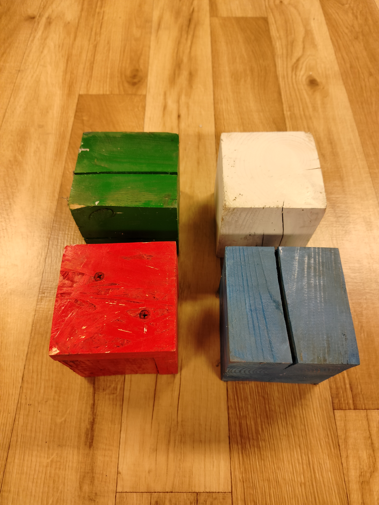

# Projekt Scorpio - zadanie rekrutacyjne do działu Software

> **Uwaga!** Przed przystąpieniem do realizacji zadania przeczytaj **całe** README i pamiętaj, żeby wypełnić [formularz rekrutacyjny]([TODO: uzupełnić]).

## Spis treści
- [Informacje ogólne](#informacje-ogólne)
- [Zadania do wykonania](#zadania-do-wykonania)
- [Wskazówki i przydatne linki](#wskazówki-i-przydatne-linki)

## Informacje ogólne
Zadanie wymaga instalacji ROS2 Humble i silnie zalecamy korzystania w tym celu z Ubuntu 22.04. Jeżeli nie chcesz instalować na swoim komputerze nowego systemu, to można zrealizować zadanie np. używając [devcontainera](https://code.visualstudio.com/docs/devcontainers/containers).

Wszystkie zadania należy wykonać w języku C++.

Rozwiązane zadanie należy umieścić w **publicznym** repozytorium (np. GitHub) i przesłać link do tego repozytorium na mail projekt@scorpio.pwr.edu.pl. Ewentualne pytania lub wątpliwości co do treści zadania można kierować na tego samego maila. Zadania przyjmujemy do (TODO: uzupełnić) do końca dnia.

## Zadania do wykonania 
Pamiętaj, że zadanie służy sprawdzeniu wielu umiejętności - nie tylko programowania i znajomości algorytmów -  więc nawet w przypadku zrealizowania tylko części z poniższych punktów, zachęcamy do przesłania rozwiązania. Postępy w zadaniu powinny być udokumentowane w repozytorium na GitHubie.

1. **Konfiguracja projektu i zbudowanie przykładu**

  - Należy zainstalować ROS2 Humble zgodnie z [oficjalną instrukcją](https://docs.ros.org/en/humble/Installation.html) na odpowiedni system.
  - Należy [utworzyć workspace ROS-owy](https://docs.ros.org/en/humble/Tutorials/Beginner-Client-Libraries/Creating-A-Workspace/Creating-A-Workspace.html), i sklonować do folderu `src` to repozytorium.
  - To repozytorium jest paczką ROS2 zawierającą przykładowego node'a, który demonstruje podstawowe funkcjonalności ROS2.
  - Należy zbudować workspace, zsourceować go, i uruchomić przykładowego node'a za pomocą `ros2 run scorpio_zadanie_rekrutacyjne_software echo` (więcej informacji o każdym z tych kroków znajdziecie w [tym tutorialu](https://docs.ros.org/en/humble/Tutorials/Beginner-Client-Libraries/Creating-A-Workspace/Creating-A-Workspace.html)) 
  - Node udostępnia dwa topici:
    - `/cube_detector/input` - topic typu `std_msgs/msg/String`, na który można wysyłać wiadomości tekstowe, które będą logowane, oraz wysyłane na `/cube_detector/output`.
    - `/cube_detector/output` - topic typu `std_msgs/msg/String`, na który node wysyła wiadomości tekstowe, które otrzymał na poprzednim topicu.
  - Należy przetestować działanie node'a komendami `ros2 topic pub` oraz `ros2 topic echo`.

  > **Wskazówka!** Możesz użyć tego przykładowego node'a jako bazy do realizacji kolejnych punktów zadania, ale nie jest to konieczne. Jeżeli wolisz, możesz stworzyć własny node lub node'y od zera, które będą realizować poniższe funkcjonalności.
  
2. **Wykrywanie kolorowych kostek na obrazie z kamery**

  - Do tego oraz kolejnego zadania został nagrany [rosbag](https://github.com/ros2/rosbag2) - należy go pobrać: [camera_bag](https://drive.google.com/drive/folders/1VAq8POilSFPc4iyDfQeEHNQKJcztpmJ5?usp=drive_link). Zostały nagrane dwa topici:
    - `/zed/zed_node/left_raw/image_raw_color` typu `sensor_msgs/msg/Image` - obraz z kamery nagrany w naszym warsztacie.
    - `/zed/zed_node/left_raw/camera_info` typu `sensor_msgs/msg/CameraInfo` - parametry kamery.

  Podczas nagrywania w warsztacie zostały rozmieszczone 4 kolorowe kostki:
  <div style="display: flex; justify-content: center; gap: 10px;">
    
  </div>

  - Należy odtworzyć rosbaga za pomocą komendy `ros2 bag play <ścieżka do pobranego folderu>`.
  
  - Dla każdej klatki obrazu odtworzonego z rosbaga należy opublikować na czterech topicach typu `geometry_msgs/msg/Point` wiadomości określające współrzędne `x` i `y` środka danej kostki na klatce w pikselach (pole `z` należy zostawić puste). Jeżeli dana kostka nie jest widoczna na klatce, to w pola x i y wstawić minimalną wartość `Float64`. Nazwy topiców powinny być następujące:
    - `cube_detector/red_cube/position_on_frame` - topic dla czerwonej kostki
    - `cube_detector/green_cube/position_on_frame` - topic dla zielonej kostki
    - `cube_detector/blue_cube/position_on_frame` - topic dla niebieskiej kostki
    - `cube_detector/white_cube/position_on_frame` - topic dla białej kostki

> **Wskazówka!** ROS2 udostępnia bibliotekę [cv_bridge](https://index.ros.org/p/cv_bridge/), pozwalającą m. in. przetwarzać obraz z topiców na `cv::Mat` z biblioteki OpenCV. Aby skorzystać z dodatkowych paczek w ramach tego projektu należy zmodyfikować `CMakeLists.txt` i `package.xml` - przykład dla tej biblioteki znajdziecie zakomentowany w tych plikach. Po zdefiniowaniu zależności polecenie `rosdep install --from-paths src -y --ignore-src` wywołane z poziomu workspace zainstaluje odpowiednie paczki.

3. **Rysowanie bounding box**

  Korzystając, w ten sam sposób, z tych samych danych z kamery, należy narysować [bounding boxy](https://docs.opencv.org/4.x/da/d0c/tutorial_bounding_rects_circles.html) wokół każdej z kostek, które będą widoczne na obrazie. Należy opublikować obraz z narysowanymi bounding boxami na topicu `cube_detector/detected_cubes/image` typu `sensor_msgs/msg/Image`. Na tym topicu powinien być publikowany obraz, który będzie taki sam jak ten z kamery, ale z narysowanymi bounding boxami wokół każdej z kostek, które są widoczne na danej klatce.

  > **Wskazówka!** Do podglądu obrazu na topicu można użyć np. `rviz2`.

4. **Wykrywanie ilmenitu**

  W folderze `assets/ilmenite_samples` znajdują się zdjęcia mikroskopowe piasku, który zawiera domieszkę ilmenitu (ciemniejsze ziarna na zdjęciu). Celem zadania jest napisanie oprogramowania implementującego metodę określania zawartości procentowej ilmenitu w całej próbce widocznej na jednym zdjęciu. W ramach pojedyńczego wywołania programu należy przeanalizować każdą próbkę zawartą w folderze. Dla każdej próbki wynik powinień być wypisany na konsolę w następujący sposób:
  ```
  sample_A.jpg - 15.0%
  sample_B.jpg - 98.0%
  [...]
  ```

  > **Wskazówka!** To zadanie nie musi zostać zaimplementowane jako node ROS-owy.

## Wskazówki i przydatne linki

- Zadanie rekrutacyjne można oddać niepełne.
- Rozwiązane zadanie należy umieścić w **publicznym** repozytorium (np. GitHub) i przesłać linka do tego repozytorium na mail projekt@scorpio.pwr.edu.pl. Ewentualne pytania lub wątpliwości co do treści zadania można kierować na tego samego maila. Zadania przyjmujemy do (TODO: uzupełnić) do końca dnia.
- [Oficjalna dokumentacja ROS2 Humble](https://docs.ros.org/en/humble/index.html)
- [Oficjalna dokumentacja RCLCPP](https://docs.ros.org/en/humble/p/rclcpp/)

**Jeżeli będziesz miał jakiekolwiek wątpliwości i problemy z zadaniem śmiało skontaktuj się z nami na maila projekt@scorpio.pwr.edu.pl! Powodzenia :)**
